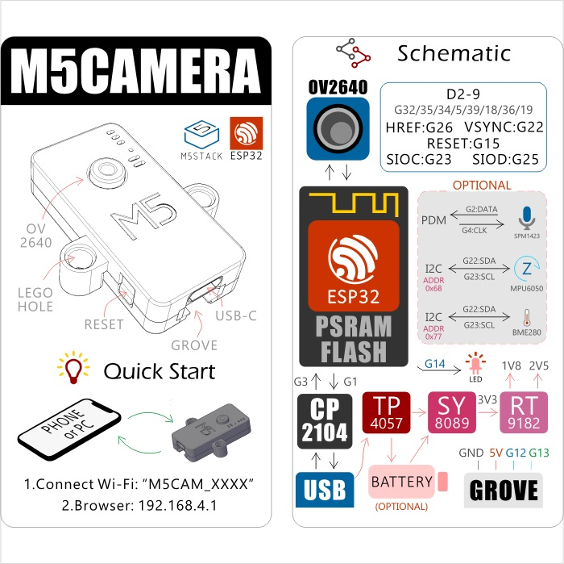

# Camera with Command Line in Single Chip

This example implements Human Face Detection with a single ESP32 chip and without LCD. ESP32 gets input of image from camera and displays results in the Command Line after recognition.

# Preparation

To run this example, you need the following components:

* ESP32 module: this example has been tested with **ESP32-WROVER**, which is highly recommended for getting started with.
* Camera module: this example has been tested with **OV2640** camera module which is highly recommended for getting started with.
* Set up [ESP-IDF](https://github.com/espressif/esp-idf)
* Set up [ESP-WHO](https://github.com/espressif/esp-who)

Any other confusions about preparation, please see general guide in the README.md of ESP-WHO.

# Quick Start

If preparations are ready, please follow this section to **connect** the camera to ESP32 module, flash application to ESP32, finally execute human face detection and display the **result**.

## Connect
Specific pins used in this example to connect ESP32 module and camera module are listed in table below.

| **Interface** | Camera Pin | Pin Mapping for ESP32-WROVER | **M5Camera**
| :--- | :---: | :---: | :---: |
| SCCB Clock | SIOC | IO27 | IO25
| SCCB Data | SIOD | IO26 | IO23
| System Clock | XCLK | IO21 | IO27
| Vertical Sync | VSYNC | IO25 | IO22
| Horizontal Reference | HREF | IO23 | IO26
| Pixel Clock | PCLK | IO22 | IO21
| Pixel Data Bit 0 | D2 | IO4 | IO32
| Pixel Data Bit 1 | D3 | IO5 | IO35
| Pixel Data Bit 2 | D4 | IO18 | IO34
| Pixel Data Bit 3 | D5 | IO19 | IO5
| Pixel Data Bit 4 | D6 | IO36 | IO39
| Pixel Data Bit 5 | D7 | IO39 | IO18
| Pixel Data Bit 6 | D8 | IO34 | IO36
| Pixel Data Bit 7 | D9 | IO35 | IO19
| Camera Reset | RESET | IO2 | IO15
| Camera Power Down | PWDN | IO0 | IO0
| Power Supply 3.3V | 3V3 | 3V3 | 3V3
| Ground | GND | GND | GND

In particular, if you have a **ESP-WROVER-KIT**, camera connector is already broken out and labeled Camera / JP4. Solder 2.54 mm / 0.1" double row, 18 pin socket in provided space and plug the camera module, OV2640 for example, right into it. Line up 3V3 and GND pins on camera module and on ESP-WROVER-KIT. D0 and D1 should be left unconnected outside the socket. The image below shows **ESP-WROVER-KIT** plugged with **OV2640** camera module.

## Results

Open a serial terminal by using `make monitor` at this project, point the camera to a human face with a distance of 0.3m at least, then you will see the following information:

The key word **DETECTED** comes out when a human face is detected.
